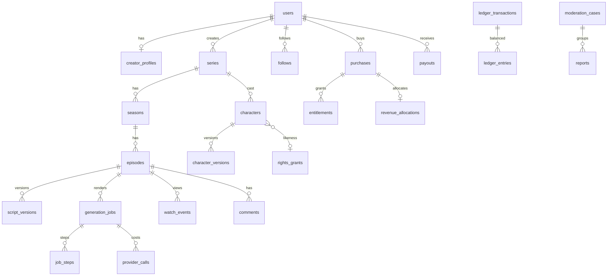

# Architecture

```
            ┌──────────── web (Next.js, PWA) ─────────────┐     ┌── mobile (Expo, planned slice) ──┐
            │ viewer feed · series · player · paywall      │     │ same API, native IAP             │
            │ Studio · creator earnings · admin            │     └──────────────────────────────────┘
            └──────────────────────┬───────────────────────┘
                                   │ REST/JSON (OpenAPI at /docs)
┌──────────────────────────────────▼─────────────────────────────────────────────────────────────┐
│ API: FastAPI modular monolith (dramaapp/)                                                       │
│  auth · studio · rights · catalog/feed/playback · commerce · creator · admin · ledger           │
│  signed media URLs · rate limits · audit events · outbox events                                 │
└───────────┬───────────────────────────┬──────────────────────────────┬─────────────────────────┘
            │ PostgreSQL (all state,    │ object storage (local FS →   │ outbox_events
            │ job leases SKIP LOCKED)   │ S3/R2), HLS, captions        │ → async consumers
┌───────────▼───────────────────────────▼──────────────────────────────┴─────────────────────────┐
│ Workers (python -m dramaapp.worker, scale independently; GPU pool for premium providers)       │
│  preflight → voice → plan → music → performance → mix → captions → compose → qc → package      │
│  providers/: llm · tts · music · video · lipsync behind adapters (registry + pricing table)    │
└────────────────────────────────────────────────────────────────────────────────────────────────┘
```

## Generation pipeline (spec §4)

| Step | Does | Output (work dir) | Billing |
|---|---|---|---|
| preflight | Text moderation, real-likeness consent check, flags for review | manifest | — |
| voice | TTS per line (cached by text + voice + emotion hash), word alignment, visemes, energy envelope | `line_*.wav`, `voice.json` | provider pass-through |
| plan | Scene plan → shot list (establishing, two, single, close, reaction), absolute cue timings | `timeline.json` | — |
| music | Score (mood) + per-scene ambience bed | `music.wav`, `ambience.wav` | — |
| performance | Frames: camera moves, lighting-graded sets, characters with lip-sync and expressions | `picture.mp4` | platform render fee |
| mix | Dialogue bus, sidechain ducking, −14 LUFS loudnorm | `mix.m4a` | — |
| captions | SRT, VTT (speaker voice tags), ASS karaoke with speaker colours and safe zone | `captions.*` | — |
| compose | Mux, burn-in captions, vignette, AI-disclosure metadata | `final.mp4` | — |
| qc | Duration, 9:16, black frames, audio, loudness, subtitle drift, identity hash, language, safety/consent | `qc.json` | — |
| package | 2-rendition HLS, thumbnail, assets + provenance, episode → `rendered` | assets | — |

**Guarantees, each covered by tests:**
- **Resumable:** the job resumes from the first step whose outputs are missing.
- **Idempotent billing:** ledger key `job:{id}:step:{name}`.
- **Retry cap:** the job is refunded when it finally fails.
- **Spend caps:** per job (`max_spend_credits`) and per account per day.
- **Cancellable:** a cancel is honoured between steps and during the frame loop.
- **Lease recovery:** a crashed worker's lease expires and another worker resumes the job.

## Data model (spec §8)



Additional tables:
- `assets`: provenance in `meta`.
- `processed_events`: webhook dedup.
- `outbox_events`: domain events, deduplicated by key.
- `audit_events`
- `experiments`

Accounting notes:
- Money is stored as integer minor units.
- Credits use currency `CRD` in the same ledger.

## Ledger (spec §5)

Every transaction balances to zero per currency and carries a unique `idempotency_key`. Balances are
always derived from the entries.

A purchase posts:

```
cash:{store}                     +(gross − fee)
expense:store_fees               +fee
liability:tax                    −tax
liability:creator:{id}:pending   −creator_share         (available_at = now + hold_days)
revenue:platform:series          −(platform_share + fee)
```

**Definitions:**
- **net** = gross − tax − store fee.
- **creator_share** = net × `creator_share_bps`.

**Lifecycle postings:**
- **Hold release** moves pending to available.
- **Refund** reverses the purchase. If the earnings were already released, it also claws them back.
- **Payout request** moves available to `payout_in_flight`.
- **Settle** moves `payout_in_flight` to `cash:payout_rail`.

**Checks:**
- The trial balance is exposed at `/admin/ledger/trial-balance`.
- Tests assert that the trial balance is zero.

## API surface (spec §9)

OpenAPI is served at `/docs`.

| Group | Endpoints |
|---|---|
| Auth and account | `POST /auth/signup`, `POST /auth/login`, `GET /me`, `POST /me/become-creator`, `POST /me/delete` |
| Studio projects | `POST/GET /studio/projects`, `GET/PATCH /studio/projects/{id}`, `POST /studio/projects/{id}/episodes` |
| Studio characters | `PATCH /studio/characters/{id}`, `POST …/lock`, `GET …/versions`, `POST …/reference-sheet`, `POST …/likeness`, `POST /studio/face-swap` |
| Studio scripts | `GET/PUT /studio/episodes/{id}/script`, `…/script/versions`, `…/script/revert/{v}` |
| Studio generation | `POST /studio/episodes/{id}/estimate`, `POST /studio/generations`, `GET /studio/jobs/{id}`, `POST …/cancel`, `POST …/resume` |
| Studio review | `GET /studio/episodes/{id}/preview`, `POST /studio/episodes/{id}/submit` |
| Rights | `GET /rights/consent-text`, `POST/GET /rights/grants`, `POST /rights/grants/{id}/revoke` |
| Viewer | `GET /feed?tab=for_you\|trending\|following\|new&genre&q`, `GET /series/{id\|slug}`, `GET /series/{id}/episodes`, `GET /episodes/{id}/playback`, `GET /media/{key}?exp&sig[&p]` |
| Engagement | `POST /watch-events`, `GET /me/history`, `POST /series/{id}/follow`, `GET/POST /episodes/{id}/comments`, `POST /reports` |
| Commerce | `GET /episodes/{id}/offer`, `POST /purchases/sandbox/checkout`, `POST /purchases/verify`, `GET /entitlements`, `POST /webhooks/sandbox-store` |
| Creator | `GET /creator/analytics`, `GET /creator/earnings`, `POST/GET /creator/payouts` |
| Admin | `/admin/review-queue`, `/admin/episodes/{id}/decision`, `/admin/moderation[/{id}]`, `/admin/rights/grants/{id}/review`, `/admin/creators/{id}/kyc`, `/admin/payouts[/{id}/settle]`, `/admin/ledger/*`, `/admin/providers`, `/admin/jobs`, `/admin/audit` |

**Outbox events:**
- GenerationRequested, GenerationStarted, GenerationCompleted, GenerationFailed
- EpisodeSubmitted, EpisodeApproved, EpisodePublished
- PurchaseVerified, EntitlementGranted, EntitlementRevoked
- RevenueAllocated, PayoutSettled, RightsRevoked

Every event carries a unique `dedup_key`.

## Security

| Control | How it is implemented |
|---|---|
| Passwords | bcrypt |
| Sessions | HS256 JWT. Roles: viewer, creator, admin |
| Media URLs | HMAC-signed with an expiry. HLS playlists are rewritten so every segment is signed, scoped to its directory |
| Entitlements | Enforced server-side, independent of URLs (spec §8) |
| Purchases and webhooks | Signature-verified; prices re-checked against the catalog; replays are idempotent |
| Rate limits | On auth, generation, purchases and reports |
| Auditing | Audit events for rights, ledger, moderation and KYC |
| Account deletion | Scrubs PII. The ledger is kept, keyed by opaque id only |
| Secrets | Come from the environment, never from the repo. The defaults are dev-only strings, and production must override them |
